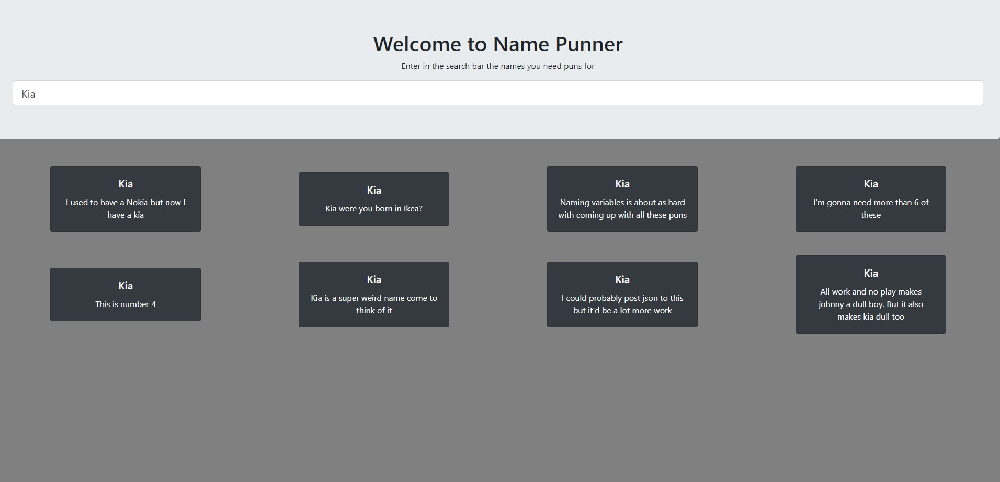

# Name Punner
###### For your punniest needs, brought to you by NobleTyler
____________

## What is Name Punner
Name punner is a simple application for when you've been meeting new people all day and you just can't seem to come up with any more name puns. It uses a database to retrieve only the best name based puns for you to use. 

<<<<<<< HEAD


## This is pretty simple what is next?
I'm glad you asked. As of now our current road map is as follows
- [x] Create front end that ties to firebase backend to display some preset puns
- [ ] Write some tests in Jest for the front end 
- [ ] Once all tests pass maybe start using branches and pull requests
- [ ] Create a backend  with [TDD](https://en.wikipedia.org/wiki/Test-driven_development)
- [ ] Query reddit and other api's and populate firebase with results then display to 
- [ ] Use an OCR library to gain even more results from reddit query

## Why I made this
Firstly I would like to thank the good people at [Devlift](https://devlift.com/) for having a pretty cool interview process. And secondly you may see some of this application in use on my other project [BetrDates](https://github.com/BetrDates) an application for finding better dates by using economics to get you only the best dating experience

## What I've learned
- This is my second React App where I've made it fully on my own using my own ideas
- It is tied for my first web app to one to tie in a backend with a React frontend. 
- It is my second time using FireBase as well and my first time using the bootstrap-react package as well as some hooks. 

# For Developers
__________ 
### How To run
In it's current iteration there is only a front end to run so far. To run all you will need to do is open your terminal or if you're using windows an installed terminal or IDE. 

```bash
git clone https://github.com/NobleTyler/NamePunner.git
cd client
npm install
npm start
```

### Potential future issues
It runs perfectly well with a very small firebase database but I'm not sure how it will work when it begins to be loaded with too much /r/tinder data. If that happens the first fix I would make is possbily adding a search button so queries don't happen on each letter typed. 


=======


>>>>>>> master
>This project was bootstrapped with [Create React App](https://github.com/facebook/create-react-app).